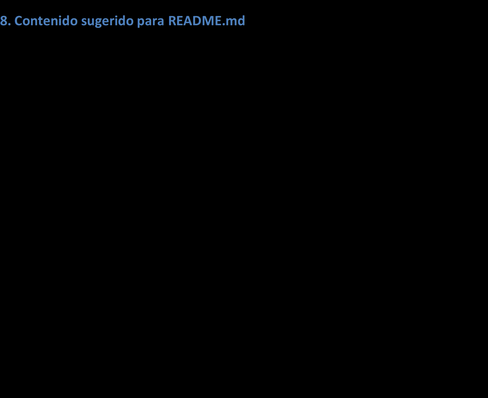

# test_maquinaria_carvel
<<<<<<< HEAD

A new Flutter project.

## Getting Started

This project is a starting point for a Flutter application.

A few resources to get you started if this is your first Flutter project:

- [Lab: Write your first Flutter app](https://docs.flutter.dev/get-started/codelab)
- [Cookbook: Useful Flutter samples](https://docs.flutter.dev/cookbook)

For help getting started with Flutter development, view the
[online documentation](https://docs.flutter.dev/), which offers tutorials,
samples, guidance on mobile development, and a full API reference.
=======
aplicacion de prueba de habilidades para el desarrollo de aplicaciones mobiles
>>>>>>> 79f162291b7d1a2297ff2cabda95b2ffcc64d6e3
